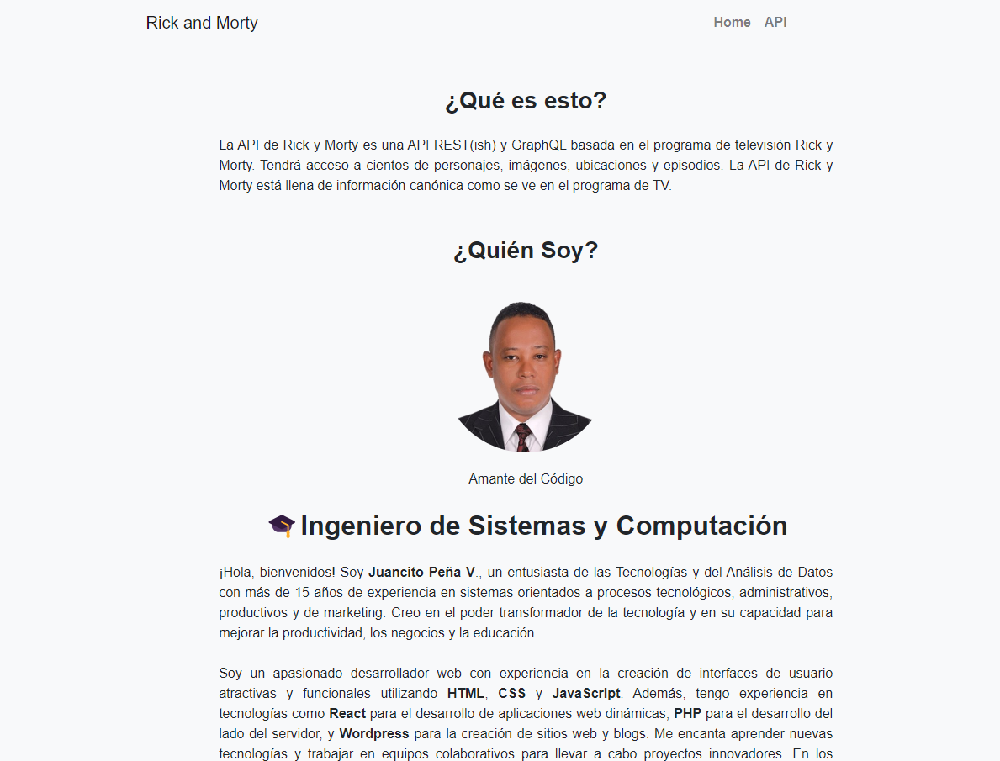

# Rick and Morty Characters API

## Descripción
Este proyecto consiste en una API basada en el universo de la serie de televisión "Rick and Morty". Proporciona acceso a cientos de personajes, imágenes, ubicaciones y episodios vistos en el programa. La API está diseñada para ser una herramienta útil para los fanáticos de la serie, así como para desarrolladores interesados en construir aplicaciones relacionadas con el universo de Rick y Morty.

---

## Tecnologías Utilizadas
- HTML
- CSS
- Bootstrap
- JavaScript

---

## Propósito
El propósito de esta aplicación es proporcionar a los programadores y aprendices una oportunidad para aprender cómo consumir una API, conectar con ella y presentar información de manera efectiva. Además, el proyecto ofrece la oportunidad de aplicar varias lógicas y diseños, como:

- Utilizar Bootstrap para organizar los personajes en tarjetas y presentarlas de manera visualmente atractiva.
- Configurar la visualización de solo 3 personajes por fila y limitar a 9 personajes por página para mejorar la legibilidad y la experiencia del usuario.
- Implementar una caja de búsqueda para facilitar la búsqueda de personajes por nombre, especie, género, etc.
- Incluir botones para realizar búsquedas y limpiar/refrescar la página para una interacción más fluida.
- Agregar botones de navegación de página para permitir al usuario moverse entre las diferentes páginas de resultados.
- Crear un menú de navegación con opciones para ir a la página de inicio y obtener información sobre la API y el proyecto.
- Asegurar que toda la aplicación sea completamente responsive para garantizar una experiencia consistente en todos los dispositivos.
  
---

## Uso de la API Rick and Morty Characters
La API se basa en la serie de televisión y proporciona datos canónicos vistos en el programa. Se puede acceder a la información utilizando consultas REST y GraphQL, lo que permite una fácil integración en aplicaciones web y móviles.

---

## Funcionalidades Adicionales
- Paginación: Permite navegar a través de grandes conjuntos de datos de forma eficiente.
- Búsqueda y Filtro: Los usuarios pueden buscar y filtrar personajes por nombre, especie, género, etc.
- Botón "Ver Más": Proporciona detalles adicionales sobre cada personaje con un solo clic.

---
## Probar el Proyecto

Puedes probar el proyecto en acción visitando la siguiente URL: [Probar el Proyecto](https://tu-url-del-proyecto.com)

---

## Capturas de Pantalla

---

## Licencia
Este proyecto está bajo la [Licencia MIT](https://opensource.org/licenses/MIT).

---

## Cómo Usar el Proyecto
1. Clona el repositorio desde GitHub: [Link del Repositorio](https://github.com/JUANCITOPENA/Rick-and-Morty-Characters-API)
2. Instala las dependencias utilizando `npm install`.
3. Ejecuta el servidor utilizando `npm start`.
4. Accede a la API desde `http://localhost:puerto/api`.

---

¡Gracias por tu interés en nuestro proyecto!
